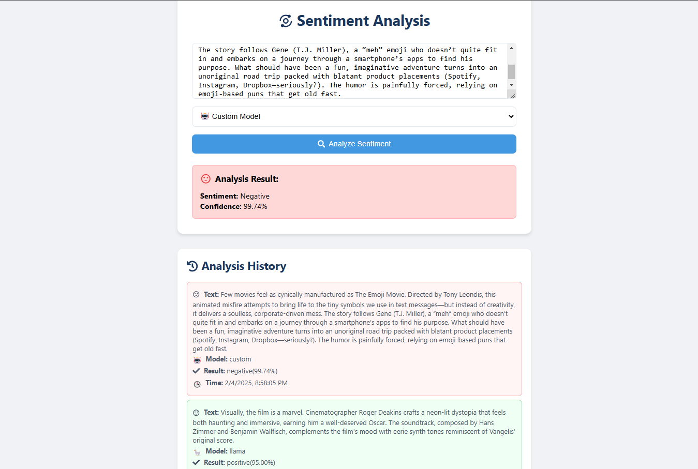

# 🎭 Sentiment Analysis System

A professional sentiment analysis system combining a custom fine-tuned model with Llama through Groq's API.

## ✨ Features

- 🤖 Custom fine-tuned model (IMDB dataset)
- 🦙 Integration with Llama model
- ⚡ Real-time analysis
- 📊 Confidence scoring
- 📝 History tracking
- 🎨 Modern React UI

## 🛠️ Technology Stack

### Backend
- 🚀 Node.js & Express
- 🤗 Hugging Face API
- ⚡ Groq API
- 🔒 CORS enabled
- 📝 dotenv

### Frontend
- ⚛️ React 19
- 💅 Styled Components
- 📱 Responsive design
- 🔄 Real-time updates

## Installation

### Prerequisites
- Node.js (v16 or higher)
- npm or yarn
- Hugging Face API key
- Groq API key

### Backend Setup
1. Clone the repository:
```bash
git clone https://github.com/yourusername/sentiment-analysis-system.git
cd sentiment-analysis-system
```

2. Install backend dependencies:
```bash
npm install
```

3. Create a .env file in the root directory:
```env
HUGGINGFACE_API_TOKEN=your_huggingface_token
GROQ_API_KEY=your_groq_api_key
PORT=3000
```

4. Start the backend server:
```bash
node server.js
```

### Frontend Setup
1. Navigate to the client directory:
```bash
cd client
```

2. Install frontend dependencies:
```bash
npm install
```

3. Start the frontend development server:
```bash
npm start
```

The application will be available at http://localhost:3001

## Project Structure

```
sentiment-analysis-system/
├── client/                     # Frontend React application
│   ├── public/                # Static files
│   ├── src/                   # React source files
│   │   ├── components/        # React components
│   │   ├── hooks/            # Custom React hooks
│   │   ├── services/         # API services
│   │   └── App.js            # Main React component
│   ├── package.json          # Frontend dependencies
│   └── .env                  # Frontend environment variables
├── tests/                    # Backend tests
│   └── api.test.js          # API endpoint tests
├── server.js                # Express server and API endpoints
├── package.json            # Backend dependencies
├── .env                    # Backend environment variables
├── .gitignore             # Git ignore rules
├── README.md              # Project documentation
├── docker-compose.yml     # Docker compose configuration
└── Dockerfile             # Docker container configuration
```

### Key Files

- `server.js`: Main backend application with Express routes and model integration
- `tests/api.test.js`: API endpoint tests using Jest and Supertest
- `client/src/services/api.js`: Frontend API integration
- `client/src/components/`: React components for UI
- `.env`: Configuration for API keys and environment variables
- `docker-compose.yml`: Multi-container Docker setup
- `Dockerfile`: Container build instructions

## API Endpoints

### POST /analyze
Analyzes text sentiment using either the custom model or Llama model.

Request body:
```json
{
    "text": "Your text to analyze",
    "model": "custom" or "llama"
}
```

Response:
```json
{
    "sentiment": "positive" or "negative",
    "confidence": 0.95
}
```

## Models Used

1. Custom Fine-tuned Model
   - Based on IMDB dataset
   - Hosted on Hugging Face Hub
   - Model ID: arashghsz/my-finetuned-model
   - Direct link: [https://huggingface.co/arashghsz/my-finetuned-model](https://huggingface.co/arashghsz/my-finetuned-model)
   - Performance metrics:
     - Accuracy: 0.92
     - F1 Score: 0.91
     - Precision: 0.90
     - Recall: 0.92

2. Llama Model via Groq
   - Using llama-3.3-70b-versatile model
   - Accessed through Groq's API
   - Optimized for sentiment analysis tasks

## Model Training Process

### Dataset and Notebook
- IMDB Movie Reviews Dataset
- 50,000 movie reviews (25,000 positive, 25,000 negative)
- Data split: 80% training, 10% validation, 10% test
- Kaggle Notebook: [IMDB Sentiment Analysis Training](https://www.kaggle.com/code/arashghasemzadeh/llms-ex03-arash-ghasemzadeh/)
- Dataset Link: [IMDB Dataset](https://www.kaggle.com/datasets/lakshmi25npathi/imdb-dataset-of-50k-movie-reviews)

### Training Environment
- Platform: Kaggle Notebooks
- GPU: P100

### Training Steps
1. Data Preprocessing
   - Cleaned HTML tags and special characters
   - Removed stopwords
   - Performed text normalization
   - Applied label encoding (positive: 1, negative: 0)

2. Model Architecture
   - Base model: DistilBERT
   - Added classification head
   - Dropout rate: 0.3
   - Hidden layers: 768

3. Training Configuration
   - Epochs: 2
   - Batch size: 32
   - Learning rate: 5e-5
   - Optimizer: AdamW
   - Weight decay: 0.01

4. Results
   - Training accuracy: 0.93
   - Validation accuracy: 0.92
   - Test accuracy: 0.91
   - Training time: ~2 hours

### Model Deployment
- Saved using Hugging Face's save_pretrained()
- Uploaded to Hugging Face Hub
- Integrated with custom API endpoint

## Local Development

1. Backend development server runs on port 3000
2. Frontend development server runs on port 3001
3. Make sure both servers are running for full functionality

## 🐳 Docker Setup

### Prerequisites
- Docker Desktop
- Docker Compose
- Valid API keys

### Environment Setup
1. Create `.env` file in root directory:
```env
HUGGINGFACE_API_TOKEN=your_token_here
GROQ_API_KEY=your_key_here
```

2. Create `.env` in client directory:
```env
PORT=3001
```

### 🚀 Quick Start with Docker

One-command setup:
```bash
docker-compose up --build
```

### 🛠️ Manual Container Management

#### Backend Container
```bash
# Build backend
docker build -t sentiment-backend .

# Run backend
docker run -p 3000:3000 \
  --env-file .env \
  sentiment-backend
```

#### Frontend Container
```bash
# Build frontend
cd client
docker build -t sentiment-frontend .

# Run frontend
docker run -p 3001:3001 \
  -e PORT=3001 \
  sentiment-frontend
```

### 🔍 Container Management Commands
```bash
# View running containers
docker ps

# Stop containers
docker-compose down

# View logs
docker-compose logs -f

# Restart services
docker-compose restart

# Remove old images
docker system prune
```

### 🐞 Troubleshooting Docker

Common issues and solutions:

1. **Port Conflicts**
```bash
# Check ports in use
netstat -ano | findstr "3000"
netstat -ano | findstr "3001"
```

2. **Container Issues**
```bash
# Reset containers
docker-compose down
docker-compose up --build --force-recreate
```

3. **Permission Issues**
```bash
# Fix permissions
chmod +x ./docker-entrypoint.sh
```

### 🔒 Docker Security Best Practices

- ✅ Use non-root users in Dockerfile
- ✅ Implement health checks
- ✅ Use multi-stage builds
- ✅ Scan images for vulnerabilities
- ✅ Keep base images updated

## Testing

### Running Tests

```bash
# Run all tests
npm test

# Run tests in watch mode
npm run test:watch

# Run specific test file
npm test tests/api.test.js
```

### Test Cases

The system includes comprehensive API tests:

1. Custom Model Analysis
```javascript
// Tests sentiment analysis with custom model
test('POST /analyze with custom model', async () => {
  const response = await request(app)
    .post('/analyze')
    .send({
      text: 'This is amazing!',
      model: 'custom'
    });

  expect(response.status).toBe(200);
  expect(response.body).toHaveProperty('sentiment');
  expect(response.body).toHaveProperty('confidence');
});
```

2. Llama Model Analysis
```javascript
// Tests sentiment analysis with Llama model
test('POST /analyze with llama model', async () => {
  const response = await request(app)
    .post('/analyze')
    .send({
      text: 'This is terrible!',
      model: 'llama'
    });

  expect(response.status).toBe(200);
  expect(response.body).toHaveProperty('sentiment');
  expect(response.body).toHaveProperty('confidence');
});
```

3. Error Handling Tests
```javascript
// Tests empty text handling
test('POST /analyze with empty text', async () => {
  const response = await request(app)
    .post('/analyze')
    .send({
      text: '',
      model: 'custom'
    });

  expect(response.status).toBe(400);
  expect(response.body).toHaveProperty('error');
});

// Tests invalid model handling
test('POST /analyze with invalid model', async () => {
  const response = await request(app)
    .post('/analyze')
    .send({
      text: 'Test text',
      model: 'invalid'
    });

  expect(response.status).toBe(400);
  expect(response.body).toHaveProperty('error');
});
```

### Manual Testing

You can also test the API endpoints manually using curl:

1. Test Custom Model:
```bash
curl -X POST http://localhost:3000/analyze \
  -H "Content-Type: application/json" \
  -d '{"text": "This movie was fantastic!", "model": "custom"}'
```

2. Test Llama Model:
```bash
curl -X POST http://localhost:3000/analyze \
  -H "Content-Type: application/json" \
  -d '{"text": "I really hated this product.", "model": "llama"}'
```

3. Test Health Check:
```bash
curl http://localhost:3000/health
```

### Expected Responses

Successful analysis:
```json
{
  "sentiment": "positive",
  "confidence": 0.95
}
```

Error response:
```json
{
  "error": "Text is required"
}
```

### Test Environment

Tests are configured to:
- Run in isolation using Jest
- Mock console outputs
- Use increased timeouts for API calls
- Handle cross-platform environment variables
- Skip actual model inference in test mode

## Video Demo

[Watch the demo on YouTube](your-youtube-link)
## Output

## License

MIT License

Copyright (c) 2025 Arash Ghasemzadeh Kakroudi

Permission is hereby granted, free of charge, to any person obtaining a copy
of this software and associated documentation files (the "Software"), to deal
in the Software without restriction, including without limitation the rights
to use, copy, modify, merge, publish, distribute, sublicense, and/or sell
copies of the Software, and to permit persons to whom the Software is
furnished to do so, subject to the following conditions:

The above copyright notice and this permission notice shall be included in all
copies or substantial portions of the Software.

THE SOFTWARE IS PROVIDED "AS IS", WITHOUT WARRANTY OF ANY KIND, EXPRESS OR
IMPLIED, INCLUDING BUT NOT LIMITED TO THE WARRANTIES OF MERCHANTABILITY,
FITNESS FOR A PARTICULAR PURPOSE AND NONINFRINGEMENT. IN NO EVENT SHALL THE
AUTHORS OR COPYRIGHT HOLDERS BE LIABLE FOR ANY CLAIM, DAMAGES OR OTHER
LIABILITY, WHETHER IN AN ACTION OF CONTRACT, TORT OR OTHERWISE, ARISING FROM,
OUT OF OR IN CONNECTION WITH THE SOFTWARE OR THE USE OR OTHER DEALINGS IN THE
SOFTWARE.
